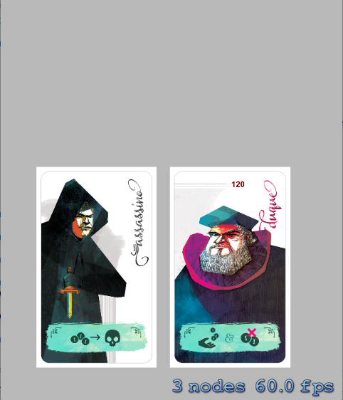

# BoardGame - The IOS Swift simple board game

This game was created to **use and develop** [BoardFramework] (https://github.com/mfdeveloper/BoardFramework) 
this project to validate them and expand to new features! Use the two together, add new amazing things and share with us!

**WARNING:** The game using rules of the famous board game [Coup](http://funboxjogos.com/loja/jogos/coup) and we strongly recomend 
that you buy the fisical game! The purpose of this project is community, students and that all people learn IOS/Swift concepts, not get money with them. All
copyright the assets (images, icons) are reserved to **[Funbox](http://funboxjogos.com)** editor and the original creater of the French fisical game :)

### Installation/Usage

1. Clone this project and import [BoardGame.xcodeproj](https://github.com/mfdeveloper/BoardGame/tree/master/BoardGame.xcodeproj) using **XCode 6.1+**.  Don't forget of run `git submodule update` in the repo to get files of the library.
2. Select a device emulator (Iphone 4s, Iphone 5...) and click on **Product -> Run** menu, or click in **Run** button
3. You should view the screen below:

### Folder structure

 - **BoardGame:** The BoardGame classes and all structures
      - **BoardFramework:** The git submodule to **BoardFramework** project
      - **Assets:** Sprite images, Scene imagens, Sounds and all the game needs to 2D graphics
      - **Images:** All other images to use in project or in github(like images showed here :D )
 - **BoardGameTests** - Unit tests
 - **build** - Folder generated by Xcode with a .app that install on phone or emulator

### See all Issues

You can see all #issues (new features, bugs, suggestions...) on a visual **Kanban Board** in amazing web application: https://waffle.io/mfdeveloper/boardgame. All #issues should be opened by this visual interface!!

### License

This is a open source project with non commercial purpose. We will check that better license (MIT, GPLV2) to
not broken patents and copyright :)

### Next implementations

- [ ] Move and refactory **drag and drop** cards from **GameScene.swift** to Card entity in [BoardFramework] (https://github.com/mfdeveloper/BoardFramework) 
- [ ] Add **flip** action in each Card. The action must be configurable (enable ou disable)
- [ ] Add left menu (like facebook) to all actions that one player can do
